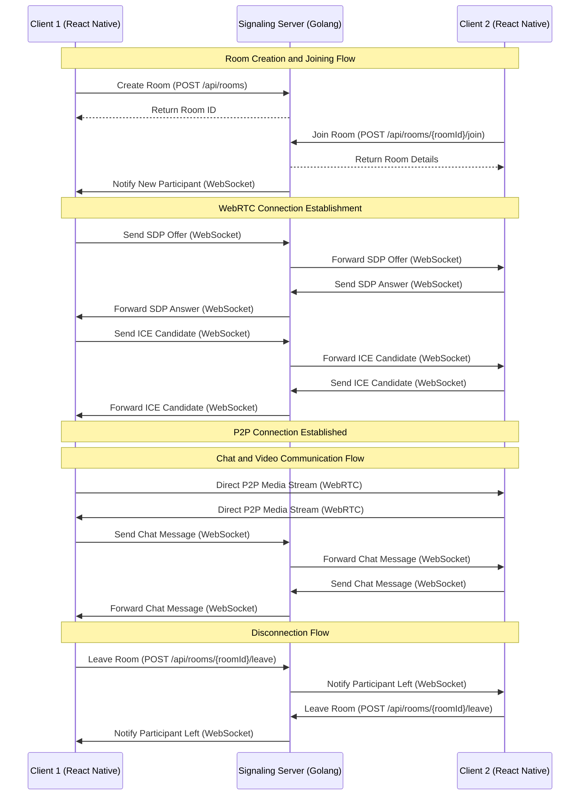
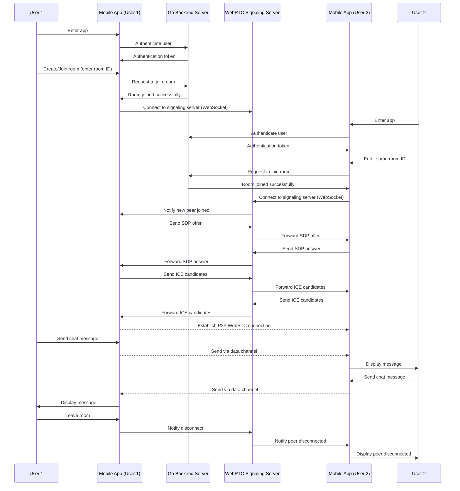
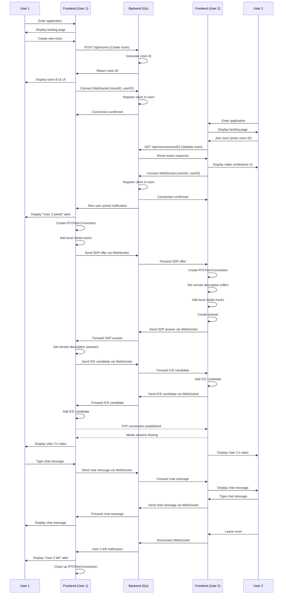

#### Sequence diagram

```mermaid
sequenceDiagram
    participant Client1 as Client 1 (React Native)
    participant Server as Signaling Server (Golang)
    participant Client2 as Client 2 (React Native)
 
    Note over Client1, Client2: Room Creation and Joining Flow
    Client1->>Server: Create Room (POST /api/rooms)
    Server-->>Client1: Return Room ID
 
    Client2->>Server: Join Room (POST /api/rooms/{roomId}/join)
    Server-->>Client2: Return Room Details
    Server->>Client1: Notify New Participant (WebSocket)
 
    Note over Client1, Client2: WebRTC Connection Establishment
    Client1->>Server: Send SDP Offer (WebSocket)
    Server->>Client2: Forward SDP Offer (WebSocket)
    Client2->>Server: Send SDP Answer (WebSocket)
    Server->>Client1: Forward SDP Answer (WebSocket)
 
    Client1->>Server: Send ICE Candidate (WebSocket)
    Server->>Client2: Forward ICE Candidate (WebSocket)
    Client2->>Server: Send ICE Candidate (WebSocket)
    Server->>Client1: Forward ICE Candidate (WebSocket)
 
    Note over Client1, Client2: P2P Connection Established
 
    Note over Client1, Client2: Chat and Video Communication Flow
    Client1->>Client2: Direct P2P Media Stream (WebRTC)
    Client2->>Client1: Direct P2P Media Stream (WebRTC)
 
    Client1->>Server: Send Chat Message (WebSocket)
    Server->>Client2: Forward Chat Message (WebSocket)
    Client2->>Server: Send Chat Message (WebSocket)
    Server->>Client1: Forward Chat Message (WebSocket)
 
    Note over Client1, Client2: Disconnection Flow
    Client1->>Server: Leave Room (POST /api/rooms/{roomId}/leave)
    Server->>Client2: Notify Participant Left (WebSocket)
    Client2->>Server: Leave Room (POST /api/rooms/{roomId}/leave)
    Server->>Client1: Notify Participant Left (WebSocket)

```

#### Detailed sequence diagram

```mermaid
sequenceDiagram
    participant User1 as User 1
    participant MobileApp1 as Mobile App (User 1)
    participant Backend as Go Backend Server
    participant SignalingServer as WebRTC Signaling Server
    participant MobileApp2 as Mobile App (User 2)
    participant User2 as User 2
    
    %% Room Creation Flow
    User1->>MobileApp1: Enter app
    MobileApp1->>Backend: Authenticate user
    Backend->>MobileApp1: Authentication token
    User1->>MobileApp1: Create/Join room (enter room ID)
    MobileApp1->>Backend: Request to join room
    Backend->>MobileApp1: Room joined successfully
    MobileApp1->>SignalingServer: Connect to signaling server (WebSocket)
    
    %% User 2 Join Flow
    User2->>MobileApp2: Enter app
    MobileApp2->>Backend: Authenticate user
    Backend->>MobileApp2: Authentication token
    User2->>MobileApp2: Enter same room ID
    MobileApp2->>Backend: Request to join room
    Backend->>MobileApp2: Room joined successfully
    MobileApp2->>SignalingServer: Connect to signaling server (WebSocket)
    
    %% WebRTC Connection Establishment
    SignalingServer->>MobileApp1: Notify new peer joined
    MobileApp1->>SignalingServer: Send SDP offer
    SignalingServer->>MobileApp2: Forward SDP offer
    MobileApp2->>SignalingServer: Send SDP answer
    SignalingServer->>MobileApp1: Forward SDP answer
    
    %% ICE Candidate Exchange
    MobileApp1->>SignalingServer: Send ICE candidates
    SignalingServer->>MobileApp2: Forward ICE candidates
    MobileApp2->>SignalingServer: Send ICE candidates
    SignalingServer->>MobileApp1: Forward ICE candidates
    
    %% Media Connection Established
    MobileApp1-->>MobileApp2: Establish P2P WebRTC connection
    
    %% Chat and Video Streaming
    User1->>MobileApp1: Send chat message
    MobileApp1-->>MobileApp2: Send via data channel
    MobileApp2->>User2: Display message
    
    User2->>MobileApp2: Send chat message
    MobileApp2-->>MobileApp1: Send via data channel
    MobileApp1->>User1: Display message
    
    %% Video streams are automatically flowing after connection established
    
    %% Disconnect Flow
    User1->>MobileApp1: Leave room
    MobileApp1->>SignalingServer: Notify disconnect
    SignalingServer->>MobileApp2: Notify peer disconnected
    MobileApp2->>User2: Display peer disconnected
```

### More detailed P2P video conferencing application

```mermaid
sequenceDiagram
    participant User1 as User 1
    participant FE1 as Frontend (User 1)
    participant BE as Backend (Go)
    participant FE2 as Frontend (User 2)
    participant User2 as User 2

    %% Room Creation
    User1->>FE1: Enter application
    FE1->>User1: Display landing page
    User1->>FE1: Create new room
    FE1->>BE: POST /api/rooms (Create room)
    BE->>BE: Generate room ID
    BE->>FE1: Return room ID
    FE1->>User1: Display room ID & UI

    %% WebSocket Connection (First User)
    FE1->>BE: Connect WebSocket (roomID, userID)
    BE->>BE: Register client in room
    BE->>FE1: Connection confirmed

    %% Second User Joins
    User2->>FE2: Enter application
    FE2->>User2: Display landing page
    User2->>FE2: Join room (enter room ID)
    FE2->>BE: GET /api/rooms/{roomID} (Validate room)
    BE->>FE2: Room exists response
    FE2->>User2: Display video conference UI

    %% WebSocket Connection (Second User)
    FE2->>BE: Connect WebSocket (roomID, userID)
    BE->>BE: Register client in room
    BE->>FE2: Connection confirmed
    BE->>FE1: New user joined notification
    FE1->>User1: Display "User 2 joined" alert

    %% WebRTC Signaling
    FE1->>FE1: Create RTCPeerConnection
    FE1->>FE1: Add local media tracks
    FE1->>BE: Send SDP offer via WebSocket
    BE->>FE2: Forward SDP offer
    FE2->>FE2: Create RTCPeerConnection
    FE2->>FE2: Set remote description (offer)
    FE2->>FE2: Add local media tracks
    FE2->>FE2: Create answer
    FE2->>BE: Send SDP answer via WebSocket
    BE->>FE1: Forward SDP answer
    FE1->>FE1: Set remote description (answer)

    %% ICE Candidate Exchange
    FE1->>BE: Send ICE candidate via WebSocket
    BE->>FE2: Forward ICE candidate
    FE2->>FE2: Add ICE candidate
    FE2->>BE: Send ICE candidate via WebSocket
    BE->>FE1: Forward ICE candidate
    FE1->>FE1: Add ICE candidate

    %% Connection Established
    FE1-->>FE2: P2P connection established
    FE2-->>FE1: Media streams flowing
    FE1->>User1: Display User 2's video
    FE2->>User2: Display User 1's video

    %% Chat Messages
    User1->>FE1: Type chat message
    FE1->>BE: Send chat message via WebSocket
    BE->>FE2: Forward chat message
    FE2->>User2: Display chat message
    User2->>FE2: Type chat message
    FE2->>BE: Send chat message via WebSocket
    BE->>FE1: Forward chat message
    FE1->>User1: Display chat message

    %% Disconnect Flow
    User2->>FE2: Leave room
    FE2->>BE: Disconnect WebSocket
    BE->>FE1: User 2 left notification
    FE1->>User1: Display "User 2 left" alert
    FE1->>FE1: Clean up RTCPeerConnection
```