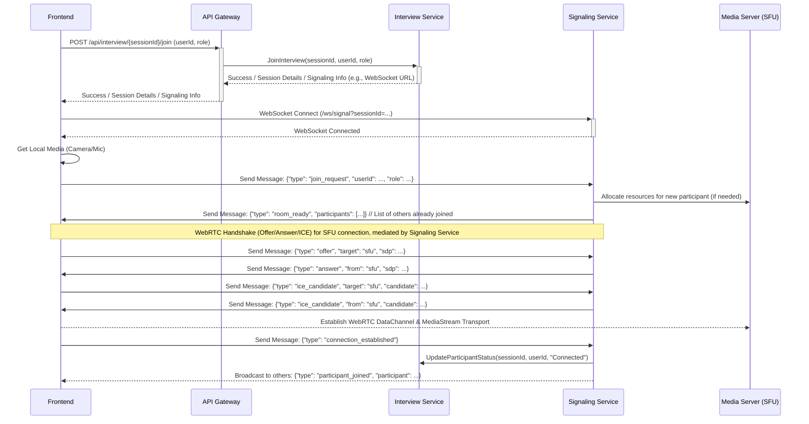

# Technical Design Document: AI Interview Video Call Application

## 1. Introduction

This document outlines the technical design for an AI-powered video interview application. The application will allow candidates to participate in video interviews where an AI agent asks questions and evaluates responses. Human interviewers can also join the session. The system leverages the Gemini API for intelligent question generation and interaction, React with TypeScript for the frontend, and Go for the backend, following Domain-Driven Design (DDD) principles.

## 2. Architecture Overview

We will adopt a **Micro-service Architecture** to promote separation of concerns, scalability, and maintainability. The primary components will be:

1.  **Frontend (React SPA):** The user interface handling video rendering, user interactions, 
and communication with the backend.
2.  **API Gateway:** A single entry point for all frontend requests, routing them to 
the appropriate backend services.
3.  **Interview Service (Go):** Manages the lifecycle and state of interview sessions.
4.  **Signaling Service (Go):** Handles WebRTC signaling for establishing peer-to-peer connections.
5.  **AI Service (Go):** Orchestrates the AI interviewer's interaction, including question
 generation (via Gemini), Speech-to-Text (STT), and Text-to-Speech (TTS).
6.  **Media Server (SFU):** A Selective Forwarding Unit (SFU) to efficiently handle multi-party 
video streams (e.g., using Pion or a managed service). This avoids mesh connections where every 
client connects to every other client, saving bandwidth and CPU.

```
graph TD
    User[Candidate/Interviewer Browser] -- HTTPS/WSS --> APIGateway[API Gateway]
    APIGateway -- REST --> InterviewService[Interview Service (Go)]
    APIGateway -- WebSocket --> SignalingService[Signaling Service (Go)]
    APIGateway -- REST --> AIService[AI Service (Go)]

    InterviewService -- CRUD --> Database[(Database)]
    AIService -- API Call --> Gemini[Gemini API]
    AIService -- API Call --> STT[Speech-to-Text Service]
    AIService -- API Call --> TTS[Text-to-Speech Service]

    User -- WebRTC --> SFU[Media Server (SFU)]
    SignalingService -- Control --> SFU
````

## 3. Domain Model (DDD)

We identify the following core domains and aggregates:

- **Interview Domain:**
    
    - `InterviewSession` (Aggregate Root): Represents a single interview instance.
        
        - `SessionID` (Entity ID)
            
        - `Status` (Value Object: Scheduled, InProgress, Completed, Cancelled)
            
        - `ScheduledTime` (Value Object)
            
        - `Participants` (List of `Participant` Entities)
            
        - `ConversationHistory` (List of `Interaction` Value Objects)
            
        - `JobDescription` (Value Object)
            
    - **`Participant`** (Entity): Represents a user (Candidate, Human Interviewer, AI) in the session.
        
        - `ParticipantID` (Entity ID)
            
        - `UserID` (Value Object, links to a user account if applicable)
            
        - `Role` (Value Object: Candidate, Interviewer, AI)
            
        - `ConnectionStatus` (Value Object: Connecting, Connected, Disconnected)
            
    - **`Interaction`** (Value Object): Records a turn in the conversation.
        
        - `Timestamp`
            
        - `Speaker` (`ParticipantID`)
            
        - `Type` (Question, Answer, Comment)
            
        - `Content` (Text)
            
- **AI Domain:**
    
    - **`AIConversation`** (Aggregate Root): Manages the state of the AI's interaction within a specific `InterviewSession`.
        
        - `SessionID` (Entity ID)
            
        - `CurrentState` (Value Object: Listening, Thinking, Speaking)
            
        - `NextQuestionPrompt` (Value Object)
            
        - `EvaluationContext` (Value Object: Accumulated understanding of candidate)
            

## 4. Components Deep Dive

- **Frontend (React TSX):**
    
    - **UI Components:** `VideoGrid`, `ParticipantVideo`, `AIChatDisplay`, `Controls` (Mute/Unmute, Video On/Off, Leave).
        
    - **State Management:** Zustand or Redux Toolkit for managing session state, participant list, connection status, AI messages.
        
    - **WebRTC Client:** Native WebRTC APIs or a library like `react-native-webrtc` (if cross-platform needed later) or `simple-peer` abstractions adapted for SFU interaction. Handles media stream acquisition and connection negotiation via the Signaling Service.
        
    - **API Client:** Axios or Fetch API for REST calls to the API Gateway. WebSocket client for signaling.
        
- **API Gateway (Go - e.g., using Gin/Echo with middleware):**
    
    - Routes `/api/interview/*` to Interview Service.
        
    - Routes `/api/ai/*` to AI Service.
        
    - Routes `/ws/signal` to Signaling Service.
        
    - Handles authentication, rate limiting, request/response logging.
        
- **Interview Service (Go):**
    
    - **Repositories:** Interfaces for database interaction (e.g., `InterviewSessionRepository`).
        
    - **Application Services:** Handles use cases like `CreateInterview`, `JoinInterview`, `GetInterviewDetails`, `UpdateParticipantStatus`.
        
    - **Domain Logic:** Encapsulated within the `InterviewSession` aggregate.
        
    - **Database:** PostgreSQL (Relational) or MongoDB (Document-based) depending on query patterns. PostgreSQL is often a good default.
        
- **Signaling Service (Go):**
    
    - Uses WebSockets (e.g., Gorilla WebSocket) for real-time communication.
        
    - Manages rooms/sessions.
        
    - Relays WebRTC signaling messages (Offers, Answers, ICE Candidates) between clients and potentially coordinates with the SFU.
        
- **AI Service (Go):**
    
    - Receives candidate audio transcriptions (via API call from Frontend or direct integration if STT is internal).
        
    - Constructs prompts for Gemini API based on conversation history, job description, and candidate response.
        
    - Calls Gemini API to get the next question or evaluation.
        
    - Calls TTS service to convert the AI's response text to audio data/URL.
        
    - Sends the AI response (text and audio reference) back via API or WebSocket message.
        
    - Manages the state (`AIConversation`) of the AI interaction.
        
- **Media Server (SFU - e.g., Pion):**
    
    - Receives media streams from participants.
        
    - Forwards streams only to subscribed participants.
        
    - Managed by the Signaling Service or has its own control plane.
        

## 5. Key Workflows & Sequence Diagrams

**a) Participant Joins Interview**



**b) AI Asks Question**

```
sequenceDiagram
    participant FE as Frontend
    participant GW as API Gateway
    participant AI as AI Service
    participant Gemini as Gemini API
    participant TTS as TTS Service
    participant SS as Signaling Service

    Note over AI: Triggered by event (e.g., candidate finished speaking, timer)
    AI->>+Gemini: Generate Question (context: history, job desc, last response)
    Gemini-->>-AI: Question Text

    AI->>+TTS: Generate Audio (text: question text)
    TTS-->>-AI: Audio Data/URL

    AI->>+GW: POST /api/ai/{sessionId}/speak
    GW->>AI: Forward request
    AI-->>GW: Response (text, audioUrl)
    GW-->>FE: Response (text, audioUrl)

    FE->>FE: Display Text Question
    FE->>FE: Play Audio (from audioUrl)

    AI->>+SS: Send Message (via internal channel or API): {"type": "ai_speaking_status", "sessionId": ..., "status": true}
    SS-->>FE: Broadcast: {"type": "ai_status", "speaking": true}
    Note over FE: UI indicates AI is speaking

    FE-->>FE: On Audio End
    AI->>+SS: Send Message: {"type": "ai_speaking_status", "sessionId": ..., "status": false}
    SS-->>FE: Broadcast: {"type": "ai_status", "speaking": false}
    Note over FE: UI indicates AI finished speaking, candidate can respond


```

**c) Candidate Responds**

```
sequenceDiagram
    participant FE as Frontend
    participant STT as STT Service
    participant GW as API Gateway
    participant AI as AI Service
    participant SS as Signaling Service

    Note over FE: User unmutes and speaks
    FE->>FE: Start Audio Capture

    FE->>+STT: Stream Audio Data / Send Audio Chunk
    STT-->>-FE: Real-time Transcription / Final Transcript

    FE->>FE: Display real-time transcript (optional)

    Note over FE: Detect end of speech (e.g., silence detection)
    FE->>+GW: POST /api/ai/{sessionId}/process_response (transcript: final_transcript)
    GW->>+AI: ProcessResponse(sessionId, transcript)
    AI-->>AI: Update AIConversation state, prepare context for next question
    AI-->>-GW: Ack / Success
    GW-->>-FE: Ack / Success

    Note over AI: AI Service now likely triggers the "AI Asks Question" workflow

    FE->>+SS: Send Message: {"type": "participant_speaking", "userId": ..., "speaking": true/false}
    SS-->>FE: Broadcast to others: {"type": "speaking_status", "userId": ..., "speaking": true/false}


```

## 6. Technology Choices Summary

- **Frontend:** React, TypeScript, Zustand/RTK, WebRTC APIs, Axios/Fetch, WebSocket Client, Tailwind CSS/MUI
    
- **Backend:** Go, Gin/Echo, Gorilla WebSocket, Pion (for SFU or use managed service), Go Gemini Client, Google Cloud STT/TTS (or other providers), PostgreSQL/MongoDB Driver
    
- **Infrastructure:** Docker, Kubernetes (optional), Cloud Provider (GCP, AWS, Azure)
    

## 7. API Design (Illustrative)

- **Interview Service (REST):**
    
    - `POST /api/interview`: Create a new interview session.
        
    - `GET /api/interview/{sessionId}`: Get session details.
        
    - `POST /api/interview/{sessionId}/join`: Add a participant.
        
    - `POST /api/interview/{sessionId}/leave`: Mark participant as left.
        
- **AI Service (REST):**
    
    - `POST /api/ai/{sessionId}/process_response`: Send candidate transcript.
        
    - `POST /api/ai/{sessionId}/speak`: (Potentially triggered internally or via admin) Make AI speak.
        
    - `GET /api/ai/{sessionId}/status`: Get AI state.
        
- **Signaling Service (WebSocket):**
    
    - Messages: `join_request`, `room_ready`, `offer`, `answer`, `ice_candidate`, `connection_established`, `participant_joined`, `participant_left`, `speaking_status`, `ai_status`, etc.
        

## 8. Testing Strategy

- **Unit Tests:** Go tests (`testing` package) for domain logic, service methods, utility functions. React tests (Jest, React Testing Library) for components and hooks.
    
- **Integration Tests:** Test interactions between services (e.g., API Gateway -> Interview Service -> DB), AI Service -> Gemini/STT/TTS mocks. Test WebSocket signaling logic.
    
- **End-to-End (E2E) Tests
